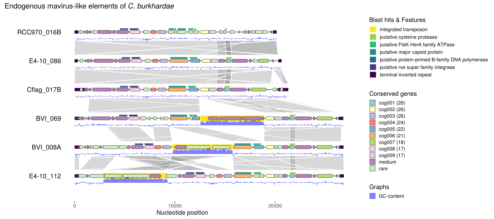

# gggenomes 

## A grammer of graphics for comparative genomics

gggenomes is an extension of [ggplot2](https://ggplot2.tidyverse.org/) allowing
you to creating informative genomic maps from biological sequence data with
ease. It builds on the power of and ggplot2 and
[tidyverse](https://www.tidyverse.org/) adding dedicated geoms, position
adjustments, and dplyr-style verbs to construct your perfect plot. Because
biological data are inherently messy, it introduces tracks to manage the
different data sources and implements a layout concept inspired by [Thomas Lin
Pedersen](https://www.data-imaginist.com/about)'s awesome
[ggraph](https://github.com/thomasp85/ggraph) package to wrap everything in a
tidy-ish structure.

## A typical use case comparing some viral genomes



```R
# pick use case data bundled with ggggenomes
data(package="gggenomes")
# Data sets in package ‘gggenomes’:
#
# emale_blast
# emale_cogs
# emale_gc
# emale_genes
# emale_links
# emale_seqs
# emale_tirs
# emale_transposons
# EMALEs: endogenous mavirus-like elements (Hackl et al. in prep.)

# set up plot with data tracks
seqs <- emale_seqs[1:6,]                # first 6 genomes only
p <- gggenomes(seqs, emale_genes, emale_tirs, emale_links) %>%
                                        # standard tracks
  add_features(emale_transposons, emale_gc) %>%
                                        # more features
  add_subfeatures(genes, emale_blast, transform="aa2nuc") %>%
                                        # features that map onto features
  add_clusters(genes, emale_cogs)       # and some gene cluster info

# add geoms and customize the plot
p <- p +
  geom_seq() + geom_bin_label() +       # chromosomes and labels
  geom_link(offset = c(0.3, 0.2), color="white", alpha=.3) +
                                        # synthenic regions
  geom_feature(aes(color="terminal inverted repeat"), use_features(2),
    size=4) +                           # repeats
  geom_feature(aes(color="integrated transposon"),
    use_features(emale_transposons), size=7) +
                                        # transposons
  geom_gene(aes(fill=cluster_label)) +  # colored genes
  geom_feature(aes(color=blast_desc), use_features(emale_blast),
    size=2, position="pile") +          # some blast hits
  geom_ribbon(aes(x=(x+xend)/2, ymax=y+.24, ymin=y+.38-(.4*score),
    group=seq_id, linetype="GC-content"), use_features(emale_gc),
    fill="blue", alpha=.5) +            # combine with ggplot2 geoms
  scale_fill_brewer("Conserved genes", palette="Set3") +
  scale_color_viridis_d("Blast hits & Features", direction = -1) +
  scale_linetype("Graphs") +
  ggtitle(expression(paste("Endogenous mavirus-like elements of ",
  italic("C. burkhardae"))))

# reverse-complement 3 genomes for better alignment
p <- p %>% flip_bins(3:5)
p
```

## Installation

```R
# install.packages("devtools")
devtools::install_github("tidyverse/gggenomes")
```
